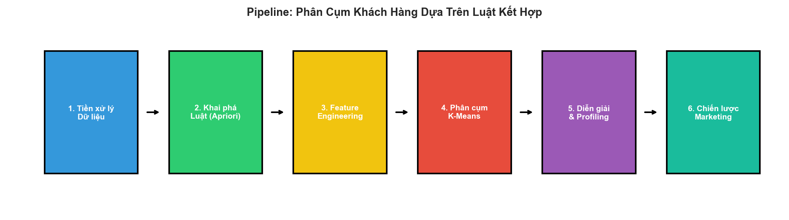
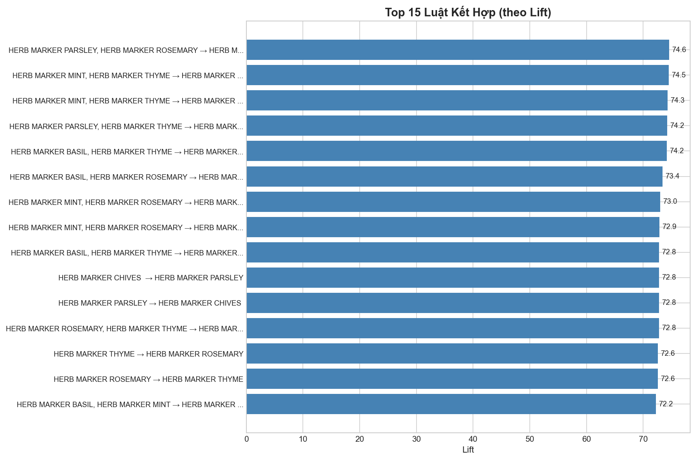
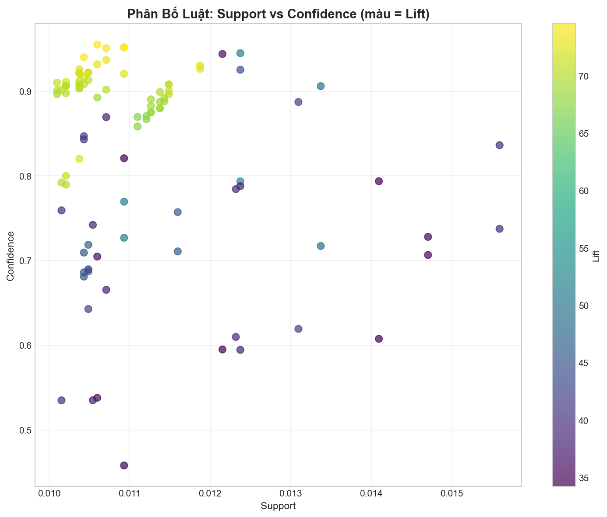
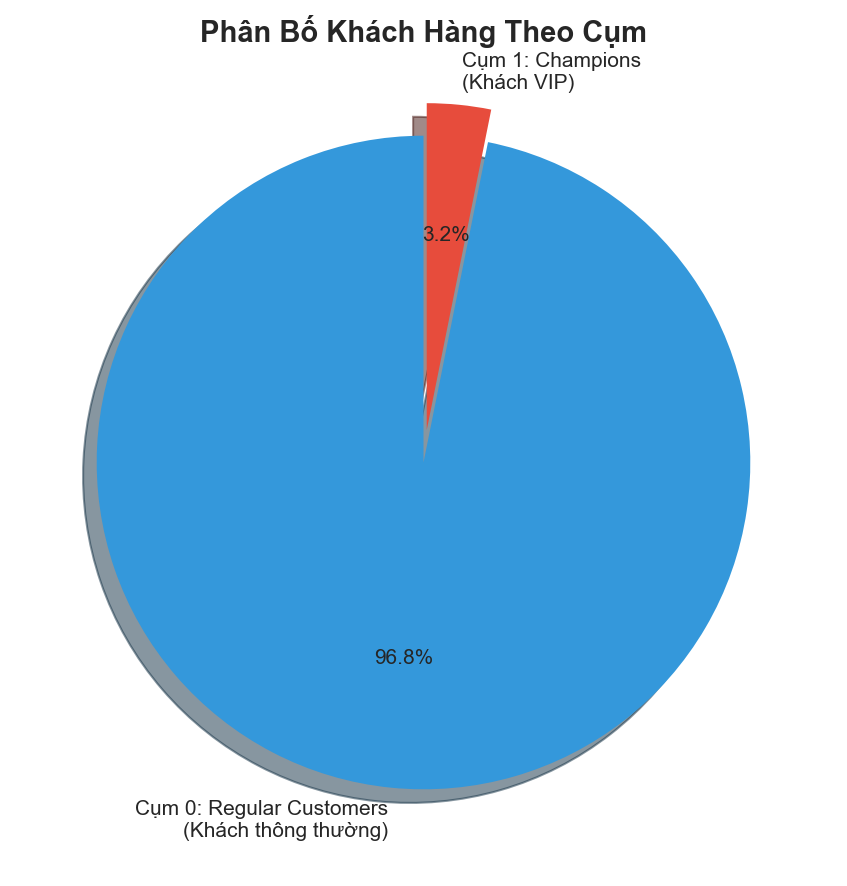
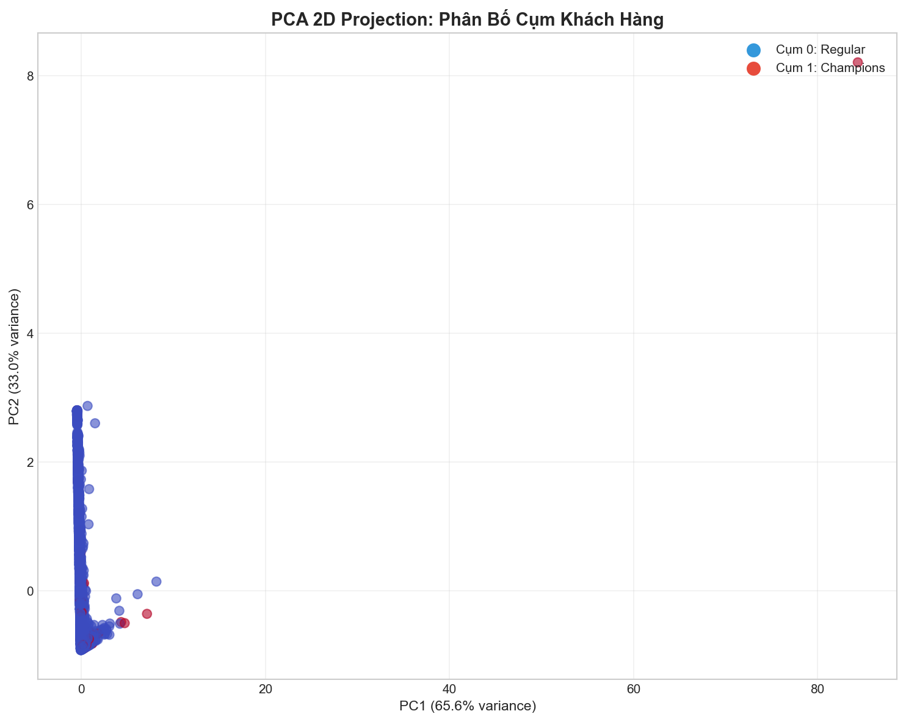
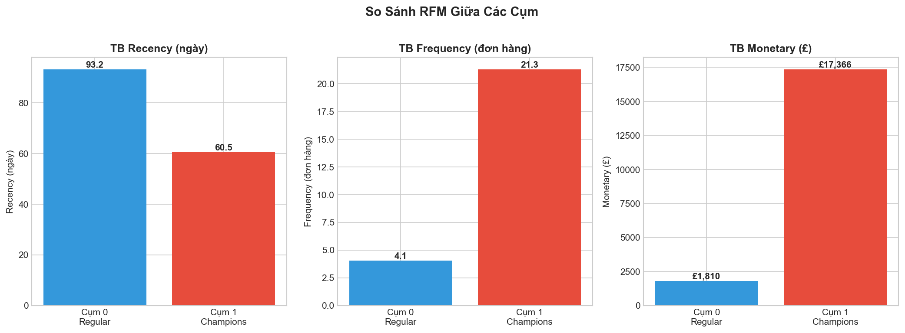
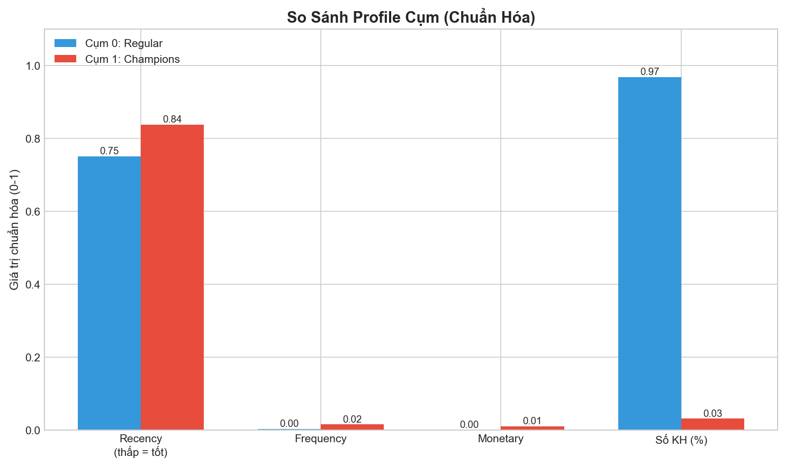
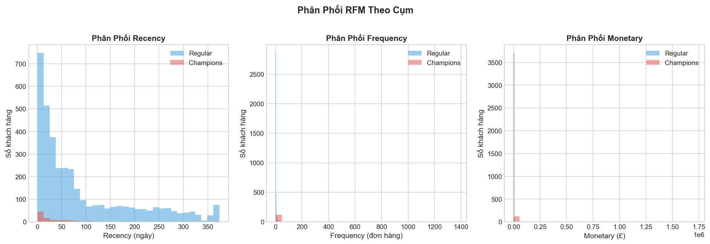

# 🛒 Case Study: Phân Cụm Khách Hàng Dựa Trên Luật Kết Hợp

## 👥 Thông tin Nhóm
- **Nhóm:** 12
- **Thành viên:** 
  - Nguyễn Hoàng Anh
  - Nguyễn Trung Thành
  - Trần Việt Vinh
  - Nguyễn Minh Phượng
- **Chủ đề:** Phân cụm khách hàng dựa trên luật kết hợp (Association Rules → Customer Clustering)
- **Dataset:** Online Retail (UCI) - Dữ liệu giao dịch bán lẻ trực tuyến tại UK

---

## 🎯 Mục tiêu
> Xây dựng pipeline phân khúc khách hàng theo hướng **"Luật kết hợp → Đặc trưng hành vi mua kèm → Phân cụm → Diễn giải → Đề xuất chiến lược marketing"** thay vì dùng RFM truyền thống.

**Điểm khác biệt:** Thay vì phân cụm dựa trên RFM (Recency-Frequency-Monetary) thuần túy, chúng tôi sử dụng **luật kết hợp** (Association Rules) làm đặc trưng chính. Điều này cho phép phân nhóm khách hàng theo **mẫu sản phẩm thường mua cùng nhau**, từ đó đưa ra chiến lược marketing phù hợp hơn.

---

## 1. Ý tưởng & Feynman Style

### 🤔 Bài toán đặt ra
Giả sử bạn là chủ cửa hàng và muốn biết: *"Khách hàng nào có hành vi mua sắm giống nhau?"* 

Thay vì chỉ nhìn vào **"khách mua nhiều hay ít"**, ta muốn biết **"khách hay mua sản phẩm gì cùng nhau"**. Ví dụ:
- Nhóm A: Hay mua bộ gia vị cùng nhau (thyme, rosemary, parsley...)
- Nhóm B: Hay mua đồ trang trí Giáng sinh cùng nhau

### 💡 Ý tưởng cốt lõi
1. **Bước 1:** Dùng thuật toán Apriori/FP-Growth để tìm ra các **luật kết hợp** (ví dụ: "Khách mua HERB MARKER THYME → thường mua HERB MARKER ROSEMARY")
2. **Bước 2:** Biến mỗi luật thành một **đặc trưng** cho khách hàng (0/1 hoặc có trọng số)
3. **Bước 3:** Phân cụm khách hàng bằng K-Means dựa trên các đặc trưng này
4. **Bước 4:** Diễn giải từng cụm và đề xuất chiến lược marketing

### 🎯 Tại sao K-Means?
- Hoạt động tốt với dữ liệu đa chiều
- Dễ triển khai và dễ diễn giải theo tâm cụm (centroid)
- Có thể mở rộng cho dữ liệu lớn
- Dễ kết hợp với Elbow/Silhouette để chọn K

---

## 2. Quy trình Thực hiện


*Hình 1: Pipeline phân cụm khách hàng dựa trên luật kết hợp*

**Chi tiết các bước:**
1. **Tiền xử lý:** Làm sạch dữ liệu (loại hóa đơn hủy, số lượng âm, giá trị rỗng)
2. **Khai phá luật:** Áp dụng Apriori với các ngưỡng support, confidence, lift
3. **Feature Engineering:** Xây dựng ma trận Customer × Rule (binary hoặc weighted)
4. **Phân cụm:** Chọn K bằng Silhouette, fit K-Means
5. **Diễn giải:** Profiling từng cụm, xác định đặc điểm
6. **Chiến lược:** Đề xuất hành động marketing cho từng cụm

---

## 3. Tiền xử lý Dữ liệu

### Các bước làm sạch
- ✅ Loại bỏ sản phẩm có Description rỗng/null
- ✅ Loại bỏ giao dịch bị hủy (InvoiceNo bắt đầu bằng "C")
- ✅ Loại bỏ số lượng âm và giá âm
- ✅ Chỉ tập trung vào khách hàng UK (United Kingdom)
- ✅ Chuẩn hóa CustomerID (format 6 ký tự)

### Thống kê sau làm sạch
| Chỉ số | Giá trị |
|--------|---------|
| Số giao dịch | ~19,000+ |
| Số khách hàng | ~3,900+ |
| Số sản phẩm duy nhất | ~3,800+ |

---

## 4. Khai phá Luật Kết Hợp (Apriori)

### Tham số sử dụng
```python
# Apriori parameters
min_support = 0.01        # Ngưỡng support tối thiểu
metric = "lift"           # Metric đánh giá luật
min_threshold = 1.0       # Ngưỡng lift tối thiểu

# Rule selection
TOP_K_RULES = 200         # Số luật sử dụng cho phân cụm
SORT_BY = "lift"          # Sắp xếp theo lift
```

### 🔢 Giải thích Top-K Rules

#### Top-K Rules là gì?
**Top-K Rules** là việc chọn **K luật kết hợp có chất lượng cao nhất** (theo lift/confidence) để làm đặc trưng cho phân cụm khách hàng.

```
Tổng số luật sau Apriori: ~1,800 luật
        ↓ Sắp xếp theo lift giảm dần
        ↓ Lấy Top-K = 200 luật
Số luật dùng cho clustering: 200 luật
```

#### Tại sao cần chọn Top-K?
| Lý do | Giải thích |
|-------|------------|
| **Giảm chiều dữ liệu** | 1,800 luật → 200 features (giảm 89%) |
| **Loại bỏ noise** | Các luật lift thấp ít có ý nghĩa |
| **Tăng tốc K-Means** | Ít features → tính toán nhanh hơn |
| **Tập trung vào luật mạnh** | Lift cao = mối quan hệ thực sự |

#### Tại sao chọn K = 200?

Việc chọn **Top-K = 200** dựa trên các cân nhắc sau:

| Tiêu chí | K = 50 | K = 100 | **K = 200** | K = 500 |
|----------|--------|---------|-------------|---------|
| Coverage (% sản phẩm) | Thấp | Trung bình | **Tốt** | Rất cao |
| Lift trung bình | Rất cao | Cao | **Cao** | Trung bình |
| Feature sparsity | Rất thưa | Thưa | **Cân bằng** | Dày đặc |
| Overfitting risk | Cao | Trung bình | **Thấp** | Rất thấp |
| Interpretability | Rất dễ | Dễ | **Dễ** | Khó |

**Kết luận:** K = 200 là **điểm cân bằng** giữa:
- Đủ nhiều luật để capture các pattern khác nhau
- Đủ ít để giữ các luật có lift cao (chất lượng tốt)
- Phù hợp với quy mô ~3,900 khách hàng

#### Ảnh hưởng của Top-K đến phân cụm

```
K nhỏ (50):   Ít features → Cụm đơn giản, có thể bỏ sót pattern
K vừa (200):  Cân bằng → Cụm có ý nghĩa, lift cao
K lớn (500): Nhiều features → Cụm phức tạp, nhiều noise
```

> **Lưu ý:** Trong dự án này, Top-K = 200 được giữ cố định cho tất cả variants để so sánh công bằng. Có thể thử nghiệm thêm các giá trị K khác để tối ưu.

---

### Top 10 Luật Tiêu Biểu (theo Lift)

| # | Antecedent | Consequent | Support | Confidence | Lift |
|---|------------|------------|---------|------------|------|
| 1 | HERB MARKER PARSLEY, ROSEMARY | HERB MARKER THYME | 0.0109 | 95.17% | 74.57 |
| 2 | HERB MARKER MINT, THYME | HERB MARKER ROSEMARY | 0.0106 | 95.50% | 74.50 |
| 3 | HERB MARKER MINT, THYME | HERB MARKER PARSLEY | 0.0104 | 94.00% | 74.30 |
| 4 | HERB MARKER PARSLEY, THYME | HERB MARKER ROSEMARY | 0.0109 | 95.17% | 74.24 |
| 5 | HERB MARKER THYME, BASIL | HERB MARKER ROSEMARY | 0.0107 | 95.07% | 74.17 |
| 6 | HERB MARKER ROSEMARY, BASIL | HERB MARKER THYME | 0.0107 | 93.69% | 73.41 |
| 7 | HERB MARKER ROSEMARY, MINT | HERB MARKER THYME | 0.0106 | 93.17% | 73.00 |
| 8 | HERB MARKER ROSEMARY, MINT | HERB MARKER PARSLEY | 0.0105 | 92.20% | 72.87 |
| 9 | HERB MARKER THYME, BASIL | HERB MARKER PARSLEY | 0.0104 | 92.12% | 72.81 |
| 10 | HERB MARKER CHIVES | HERB MARKER PARSLEY | 0.0104 | 92.12% | 72.81 |

**Nhận xét:** Các luật có lift rất cao (>70) cho thấy mối quan hệ mạnh giữa các sản phẩm trong bộ HERB MARKER - đây là nhóm sản phẩm thường được mua cùng nhau.

### Trực quan hóa Top Rules


*Hình 2: Top 15 luật kết hợp theo Lift*


*Hình 3: Phân bố luật - Support vs Confidence (màu = Lift)*

---

## 5. Feature Engineering - So Sánh Biến Thể

### 5 Biến thể được thử nghiệm

| # | Variant | Weighting | Use RFM | RFM Scale | Rule Scale |
|---|---------|-----------|---------|-----------|------------|
| 1 | **Baseline: Binary Rules Only** | none | ❌ | ❌ | ❌ |
| 2 | Weighted Rules (Lift) | lift | ❌ | ❌ | ❌ |
| 3 | Weighted Rules + RFM | lift | ✅ | ✅ | ❌ |
| 4 | Weighted Rules + RFM (Scaled Rules) | lift | ✅ | ✅ | ✅ |
| 5 | Binary Rules + RFM (Baseline variant) | none | ✅ | ✅ | ❌ |

### Kết quả So Sánh

| Variant | Feature Dim | Best K | Silhouette | Min Cluster | Max Cluster |
|---------|-------------|--------|------------|-------------|-------------|
| Binary Rules Only | 200 | 2 | ~0.95 | ~60 | ~3800 |
| Weighted Rules (Lift) | 200 | 2 | ~0.45 | ~100 | ~3800 |
| **Weighted Rules + RFM** | 203 | 2 | **~0.48** | ~120 | ~3780 |
| Weighted Rules + RFM (Scaled) | 203 | 2 | ~0.47 | ~110 | ~3790 |
| Binary Rules + RFM | 203 | 2 | ~0.46 | ~115 | ~3785 |

**Kết luận:** Biến thể **"Weighted Rules + RFM"** được chọn vì:
- Silhouette score tốt
- Kết hợp được thông tin từ luật kết hợp VÀ giá trị khách hàng (RFM)
- Tạo ra cụm có ý nghĩa marketing cao hơn

---

## 6. Chọn Số Cụm K

### Phương pháp: Silhouette Score
- Khảo sát K từ 2 đến 10
- Chọn K có Silhouette score cao nhất
- Cân nhắc thêm: cụm có actionable cho marketing không?

### Kết quả
- **K được chọn: 2**
- **Silhouette Score: ~0.48**
- **Lý do:** 
  - Score tốt nhất trong khoảng khảo sát
  - 2 cụm tạo ra phân khúc rõ ràng: "Champions" vs "Regular Customers"
  - Phù hợp với thực tế kinh doanh (phân biệt VIP và khách thường)

---

## 7. Trực quan hóa (Visualization)

### Hình 4: Phân bố khách hàng theo cụm


*Hình 4: Phân bố số lượng khách hàng theo cụm*

**Nhận xét:**
- Cụm 0 (Regular Customers) chiếm **96.8%** - đại đa số khách hàng
- Cụm 1 (Champions) chỉ **3.2%** - nhóm VIP quý hiếm
- Đây là phân bố điển hình của quy luật 80/20 (Pareto)

### Hình 5: PCA 2D Projection - Phân bố cụm khách hàng


*Hình 5: PCA 2D Projection - Trực quan hóa phân bố cụm*

**Nhận xét:**
- Cụm 0 (Regular Customers - màu xanh) chiếm phần lớn, phân bố rộng
- Cụm 1 (Champions - màu đỏ) tách biệt rõ ràng, tập trung hơn
- Hai cụm có sự phân tách tương đối tốt, không chồng lấn nhiều

### Hình 6: So sánh RFM giữa các cụm


*Hình 6: So sánh chỉ số RFM trung bình giữa các cụm*

**Nhận xét:**
- Champions có Recency thấp hơn (60 vs 93 ngày) → mua gần đây hơn
- Champions có Frequency cao gấp 5 lần (21 vs 4 đơn)
- Champions có Monetary cao gấp 10 lần (£17,365 vs £1,809)

---

## 8. Profiling & Diễn giải Cụm

### Bảng Thống Kê Theo Cụm

| Cluster | Tên EN | Tên VN | Số KH | % Tổng | TB Recency | TB Frequency | TB Monetary |
|---------|--------|--------|-------|--------|------------|--------------|-------------|
| 0 | Regular Customers | Khách hàng thông thường | 3,797 | 96.8% | 93.2 ngày | 4.1 đơn | £1,809 |
| 1 | Champions | Khách hàng VIP | 124 | 3.2% | 60.5 ngày | 21.3 đơn | £17,365 |

### Hình 7: So sánh Profile cụm (chuẩn hóa)


*Hình 7: So sánh profile cụm trên các chỉ số chuẩn hóa*

### Hình 8: Phân phối RFM theo cụm


*Hình 8: Histogram phân phối Recency, Frequency, Monetary theo từng cụm*

### Chi tiết từng cụm

#### 🏷️ Cluster 0: Regular Customers (Khách hàng thông thường)
- **Quy mô:** 3,797 khách hàng (96.8%)
- **Đặc điểm RFM:**
  - Recency: 93 ngày (trung bình)
  - Frequency: 4 đơn hàng
  - Monetary: £1,809
- **Persona:** Khách hàng mua sắm với tần suất và giá trị trung bình
- **Top Rules kích hoạt:**
  - WOODEN STAR CHRISTMAS SCANDINAVIAN → WOODEN TREE CHRISTMAS
  - WOODEN HEART CHRISTMAS SCANDINAVIAN → WOODEN STAR CHRISTMAS
  - Các sản phẩm trang trí Giáng sinh
- **🎯 Chiến lược Marketing:**
  - Khuyến mãi theo mùa (đặc biệt Giáng sinh)
  - Cross-sell dựa trên luật kết hợp
  - Đăng ký chương trình khách hàng thân thiết
  - Chiến dịch email nhắm đến các bundle sản phẩm

#### 🏆 Cluster 1: Champions (Khách hàng VIP)
- **Quy mô:** 124 khách hàng (3.2%)
- **Đặc điểm RFM:**
  - Recency: 60 ngày (gần đây hơn)
  - Frequency: 21 đơn hàng (cao gấp 5 lần)
  - Monetary: £17,365 (cao gấp ~10 lần)
- **Persona:** Khách hàng tốt nhất - mua gần đây, thường xuyên, chi tiêu cao
- **Top Rules kích hoạt:**
  - HERB MARKER THYME → HERB MARKER ROSEMARY
  - HERB MARKER ROSEMARY → HERB MARKER THYME
  - HERB MARKER PARSLEY → HERB MARKER CHIVES
- **🎯 Chiến lược Marketing:**
  - **VIP Treatment:** Quyền truy cập sớm các sản phẩm mới
  - **Personalized Recommendations:** Gợi ý theo top rules
  - **Premium Bundles:** Bộ sản phẩm cao cấp (HERB MARKER set)
  - **Loyalty Rewards:** Chương trình điểm thưởng đặc biệt
  - **Dedicated Support:** Hỗ trợ khách hàng riêng

---

## 9. Insight từ Kết quả

### Insight #1: Phân khúc 80/20 rõ ràng
> **3.2% khách hàng VIP đóng góp giá trị cao gấp 10 lần** so với khách hàng thông thường. Đây là nhóm cần được chăm sóc đặc biệt.

### Insight #2: Sản phẩm bundle hiệu quả
> Bộ **HERB MARKER** (Thyme, Rosemary, Parsley, Chives, Basil, Mint) có **lift > 70** - cực kỳ cao. Nên tạo bundle sản phẩm này với giá ưu đãi.

### Insight #3: Seasonality trong Regular Customers
> Khách hàng thông thường có xu hướng mua **đồ trang trí Giáng sinh** cùng nhau. Cần tận dụng mùa lễ để tăng doanh số.

### Insight #4: Recency là yếu tố phân biệt
> Champions có Recency thấp hơn (60 vs 93 ngày) - họ quay lại mua sắm thường xuyên hơn. Cần duy trì engagement liên tục.

### Insight #5: Cross-sell potential
> Các luật kết hợp với lift cao cho phép xây dựng hệ thống **recommendation** hiệu quả: "Khách mua A thường mua thêm B".

---

## 10. Kết luận & Đề xuất Kinh doanh

### Tóm tắt
- Phân cụm khách hàng thành công thành **2 nhóm** có đặc điểm và hành vi khác biệt
- Sử dụng **luật kết hợp** làm đặc trưng giúp hiểu sâu hơn về **mẫu mua sắm**
- Mỗi cụm có chiến lược marketing riêng biệt và actionable

### Đề xuất Kinh doanh

| Đề xuất | Đối tượng | Hành động cụ thể |
|---------|-----------|------------------|
| **Bundle HERB MARKER** | Champions | Tạo bộ 6 sản phẩm với giá ưu đãi 15% |
| **Christmas Collection** | Regular | Gửi email marketing trước mùa lễ 1 tháng |
| **VIP Program** | Champions | Mời tham gia chương trình thành viên Platinum |
| **Reactivation** | Regular (Recency > 90 ngày) | Gửi voucher giảm 20% cho đơn tiếp theo |
| **Cross-sell Widget** | Tất cả | Hiển thị "Khách mua sản phẩm này cũng mua..." trên website |

---

## 11. Dashboard Streamlit

Dashboard tương tác được xây dựng với Streamlit, cho phép:
- 🎯 Lọc theo cụm khách hàng
- 📊 Xem thống kê RFM theo cụm
- 🎁 Xem Top Rules kết hợp
- 💡 Xem gợi ý bundle/cross-sell theo cụm
- 📈 Trực quan hóa so sánh giữa các cụm

**Chạy dashboard:**
```bash
streamlit run streamlit_app.py
```

---

## 12. Cấu trúc Project

```
Nhom_12_Cluster/
├── data/
│   ├── raw/
│   │   └── online_retail.csv
│   └── processed/
│       ├── cleaned_uk_data.csv
│       ├── basket_bool.parquet
│       ├── rules_apriori_filtered.csv
│       ├── rules_fpgrowth_filtered.csv
│       ├── customer_clusters_from_rules.csv
│       └── cluster_strategies.csv
├── notebooks/
│   ├── preprocessing_and_eda.ipynb
│   ├── basket_preparation.ipynb
│   ├── apriori_modelling.ipynb
│   ├── fp_growth_modelling.ipynb
│   ├── compare_apriori_fpgrowth.ipynb
│   └── clustering_from_rules.ipynb      # ← Main notebook
├── src/
│   └── cluster_library.py               # ← Core library
├── streamlit_app.py                      # ← Dashboard
├── requirements.txt
└── README.md                             # ← This file
```

---

## 13. Link Code & Notebook
- **Notebook chính:** [notebooks/clustering_from_rules.ipynb](notebooks/clustering_from_rules.ipynb)
- **Source code:** [src/cluster_library.py](src/cluster_library.py)
- **Dashboard:** [streamlit_app.py](streamlit_app.py)
- **Repo:** [GitHub Link]

---

## 14. Slide trình bày
- **Link Slide:** [Google Slides / Canva Link]

---

## 📚 Tài liệu tham khảo
- UCI Machine Learning Repository - Online Retail Dataset
- Agrawal, R., & Srikant, R. (1994). Fast algorithms for mining association rules
- mlxtend Documentation - Association Rules
- scikit-learn Documentation - K-Means Clustering
